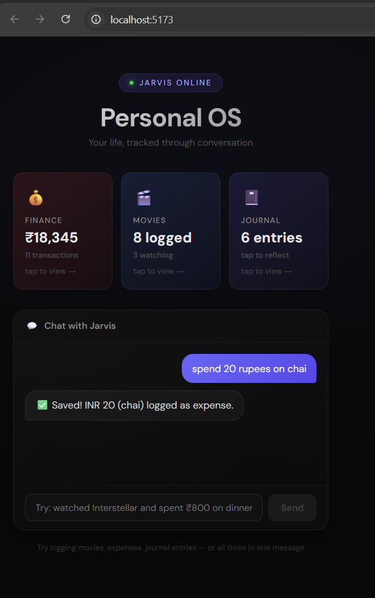

# Personal OS - A Jarvis-Style Life Tracker

A conversational life tracker built with LangGraph, LangChain, and React. Log finances, movies, and journal entries through natural language - no forms, no navigation, just talk to it.

> _"I watched Interstellar halfway through last night and spent ₹800 on dinner"_
>
> The agent detects two intents, fans out to both nodes in parallel, pushes rich UI cards inline in the chat, and only commits after you approve each one.



---

## Architecture

```
User Message (Natural Language)
        │
        ▼
┌─────────────────────┐
│   Intent Router     │  ← Gemini structured output → IntentClassification
│   (Pydantic schema) │    detects 1 or multiple intents
└────────┬────────────┘
         │
   fan_out_by_intent()  ← returns Send() objects for parallel execution
         │
   ┌─────┴──────┬──────────────┐
   ▼            ▼              ▼
Finance      Movie          Journal
 Node         Node           Node
   │            │              │
   │       push_ui_message()   │  ← Generative UI: renders React components from the graph
   │            │              │
   ├── interrupt() ────────────┘  ← Finance + Movie pause for confirmation
   │                                 Journal saves instantly (intentional — low-stakes writes)
   ▼
 User approves / rejects each
   │
   ▼
 Write to SQLite
```

One message can trigger multiple nodes simultaneously. The router classifies intent into a typed list using `with_structured_output(method="json_schema")`, and `fan_out_by_intent()` dispatches `Send()` objects for parallel execution. Each branch runs independently in the same superstep, and the `add_messages` reducer merges results back into state.

---

## What's Built

**Agent layer** — LangGraph `StateGraph` with conditional routing, parallel fan-out via the Send API, and `interrupt()` for human-in-the-loop confirmation. The router uses Pydantic + Literal types to constrain classification to exact intent strings.

**Finance node** — Extracts amount, currency, category, description, and type from natural language. Pauses with `interrupt()` before writing. On approval, commits to SQLite via SQLAlchemy.

**Movie node** — Extracts title, viewing status, progress, mood tags, context tags, and notes. Pushes a `MovieLogCard` React component directly from the graph using `push_ui_message()` (Generative UI). Pauses for confirmation before saving.

**Journal node** — Extracts content, mood, topic tags, and a reminder interval. Saves instantly without confirmation — a deliberate architectural decision since journal entries are low-stakes and confirmation adds friction with zero benefit.

**Multi-intent handling** — "Watched Interstellar and spent ₹800 on dinner" fans out to movie + finance nodes in parallel. Both hit `interrupt()` simultaneously, each gets its own interrupt ID. All decisions are collected before a single resume call using the `{interrupt_id: value}` dict format.

**Dashboard** — Three clickable stat tiles (Finance, Movies, Journal) that open modal overlays with full data views. Powered by a separate FastAPI server with REST endpoints.

**Frontend** — Dark gradient UI with DM Sans typography, bubble-style chat, inline Generative UI cards, and interrupt-based confirmation flow. Built with React + TypeScript + Vite, connected via `@langchain/langgraph-sdk`'s `useStream()` hook.

---

## Tech Stack

| Layer | Technology | Version |
|---|---|---|
| Agent Framework | LangGraph (StateGraph, interrupt, Send API) | ≥1.1.1 |
| LLM | Google Gemini 3.1 Flash Lite via `langchain-google-genai` | ≥4.2.1 |
| LLM Framework | LangChain | ≥1.2.12 |
| Structured Output | `with_structured_output(method="json_schema")` | — |
| Backend | Python + FastAPI + Uvicorn | 3.12+ / ≥0.135.1 |
| Package Manager (Python) | `uv` | Latest |
| Frontend | React + TypeScript + Vite | 19 / 5.9 / 7.3 |
| Package Manager (JS) | `pnpm` | 10.26 |
| Streaming UI | `@langchain/langgraph-sdk` — `useStream()` hook | ≥1.7.2 |
| Database | SQLite via SQLAlchemy | ≥2.0.48 |

---

## LangGraph Concepts Demonstrated

- **`StateGraph`** with `TypedDict` state and `Annotated` reducers (`add_messages`, `ui_message_reducer`)
- **Conditional edges** — router branches to different nodes based on LLM intent classification
- **Send API** — parallel fan-out for multi-intent messages (map-reduce pattern)
- **`interrupt()`** — human-in-the-loop pause before write operations
- **`push_ui_message()`** — Generative UI: the agent renders typed React components directly in the chat
- **`useStream()`** — React hook with `onCustomEvent` for real-time streaming and UI card rendering

---

## Project Structure

```
personal-os/
├── backend/                          # Python 3.12+ (uv)  ~19 files
│   ├── agent/                        # LangGraph agent core
│   │   ├── graph.py                  # StateGraph engine — routing, edges, fan-out logic
│   │   ├── state.py                  # AgentState TypedDict (messages, ui, intent)
│   │   ├── llm.py                    # Lazy-loaded Gemini via @lru_cache
│   │   └── nodes/                    # Domain-specific graph nodes
│   │       ├── router.py             # Intent classifier — Pydantic + Literal types → structured output
│   │       ├── finance.py            # Transaction extraction + interrupt + DB write
│   │       ├── movie.py              # Movie extraction + Generative UI card + interrupt + DB write
│   │       └── journal.py            # Journal extraction + instant save + Generative UI
│   ├── models/
│   │   └── database.py               # SQLAlchemy models: Transaction, MovieLog, JournalEntry + session mgmt
│   ├── api.py                        # FastAPI REST server — /api/finance, /api/movies, /api/journal
│   ├── main.py                       # Entry point (minimal — unused in current flow)
│   ├── langgraph.json                # LangGraph dev server config — defines assistants
│   └── pyproject.toml                # uv project config — dependencies, metadata
│
├── frontend/                         # React 19 + Vite 7 + TypeScript (pnpm)  ~22 files
│   └── src/
│       ├── App.tsx                   # Main hub — chat UI, useStream(), interrupts, stats tiles, modals
│       ├── main.tsx                  # React root mount → #root
│       ├── App.css                   # App-level styles
│       ├── index.css                 # Base global styles
│       └── components/
│           ├── ui/                   # Generative UI cards (pushed from graph nodes)
│           │   ├── MovieLogCard.tsx   # Inline movie log card with status, mood, context tags
│           │   └── JournalEntryCard.tsx  # Inline journal card with mood badge, tags, reminder
│           └── dashboard/            # Modal tab views (fetch from FastAPI)
│               ├── FinanceTab.tsx    # Transactions list + summary + category breakdown
│               ├── MoviesTab.tsx     # Movie grid with status filters
│               └── JournalTab.tsx    # Journal timeline + mood distribution
│
├── learning_notes/                   # Dev learning docs
│   ├── useStream.md                  # Notes on @langchain/langgraph-sdk useStream hook
│   └── why.md                        # Design rationale notes
├── test_run_results_images/          # App screenshots
├── CONTEXT.md                        # Project context / spec
└── README.md
```

---

## Key Patterns

| Pattern | Where | Details |
|---|---|---|
| **Conditional fan-out** | `graph.py` | Multi-intent messages routed to parallel nodes via `Send()` objects |
| **Human-in-the-loop** | `finance.py`, `movie.py` | `interrupt()` pauses the graph for user approval before DB writes |
| **Generative UI** | `movie.py`, `journal.py` | `push_ui_message()` renders typed React components inline in chat |
| **Structured output** | `router.py` | LLM returns JSON Schema–validated intent classification via Pydantic |
| **Lazy LLM singleton** | `llm.py` | `@lru_cache` avoids re-init and circular imports |

---

## How to Run

Requires three terminals:

```bash
# Terminal 1 — LangGraph agent server (port 2024)
cd backend
source .venv/Scripts/activate   # or .venv/bin/activate on macOS/Linux
langgraph dev                   # reads langgraph.json → loads agent/graph.py:graph

# Terminal 2 — FastAPI data server (port 8000)
cd backend
source .venv/Scripts/activate
uvicorn api:app --port 8000 --reload   # serves /api/finance, /api/movies, /api/journal

# Terminal 3 — React frontend (port 5173)
cd frontend
pnpm dev                        # Vite dev server → connects to LangGraph on :2024 + FastAPI on :8000
```

### Data Flow

```
React (:5173) ──useStream()──▶ LangGraph API (:2024) ──agent nodes──▶ SQLite
       │                                                                 │
       └────── fetch /api/* ──▶ FastAPI (:8000) ◀────── SQLAlchemy ──────┘
```

---

## Key Design Decisions

**Why no interrupt for journal?** Journal entries are low-stakes. Confirmation adds friction with zero benefit. This is an intentional decision — it shows understanding of when NOT to use human-in-the-loop.

**Why `method="json_schema"` not `function_calling`?** Gemini is more reliable with native JSON schema mode, which constrains generation at the token level. `function_calling` relies on post-processing and was producing occasional failures.

**Why `lru_cache` on `get_llm()`?** `ChatGoogleGenerativeAI` validates the API key at instantiation. If instantiated at module import, it fails before `.env` is loaded. Lazy loading with `lru_cache` fixes this.

**Why poll `/threads/{id}/state` for interrupts?** In LangGraph dev mode, `stream.interrupt` doesn't populate reliably when a run hits `interrupt()`. Polling thread state directly is the workaround.

**Why resume with a dict, not an array?** LangGraph requires `{interrupt_id: value}` format for multiple parallel interrupts. Arrays fail with RuntimeError.

---

## Database Models

```python
Transaction:  id, amount, currency, category, description, type, created_at
MovieLog:     id, title, status, progress, mood_tags (JSON), context_tags (JSON), notes, created_at
JournalEntry: id, content, mood, tags (JSON), reminder_days, created_at
```

---

## What's Next

- **Chroma memory layer** — vector store so the agent learns patterns over time (e.g., "you usually tag dramas as Emotional")
- **Audit trail UI** — timeline showing every agent decision: what it understood, planned, and committed
- **Trip log module** — sub-graph for multi-stop travel logging with cost summaries
- **LangSmith tracing** — full observability for every LLM call
- **Soft delete / undo** — `deleted_at` column + undo last action
- **Natural language queries** — "How much did I spend last month?" or "Show me all movies I marked as Inspirational"

---

## Some Rules

- `feat:` for new things, `fix:` for bug fixes, `chore:` for setup/config.
