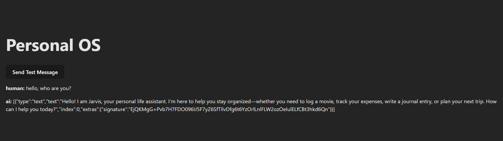

# backend working notes

- setting up backend with [uv](https://docs.astral.sh/uv/guides/projects/)

```bash
abhis@Tinku MINGW64 ~/Desktop/personal-os/backend (main)
$ uv init
Initialized project `backend`
abhis@Tinku MINGW64 ~/Desktop/personal-os/backend (main)
$ uv venv
Using CPython 3.12.7
Creating virtual environment at: .venv
Activate with: source .venv/Scripts/activate

abhis@Tinku MINGW64 ~/Desktop/personal-os/backend (main)
$ source .venv/Scripts/activate
(backend)
abhis@Tinku MINGW64 ~/Desktop/personal-os/backend
# venv activated
abhis@Tinku MINGW64 ~/Desktop/personal-os/backend (main)
$ uv add langchain-google-genai langgraph langchain python-dotenv langgraph-cli
Resolved 50 packages in 1.13s
Prepared 7 packages in 654ms
Installed 49 packages in 864ms

abhis@Tinku MINGW64 ~/Desktop/personal-os/backend (main)
$ uv add "langgraph-cli[inmem]"
Resolved 81 packages in 2.04s
Prepared 5 packages in 832ms
Installed 31 packages in 587ms
# To run LangGraph application locally and to use `langgraph dev` to spin up the LangGraph API Server locally
```

- What each package does:
- [langgraph](https://docs.langchain.com/oss/python/langgraph/overview) - the StateGraph engine, interrupt, checkpointing
- [langchain](https://docs.langchain.com/oss/python/langchain/overview) - tool binding, LCEL, structured output
- [langchain-google-genai](https://docs.langchain.com/oss/python/integrations/chat/google_generative_ai#setup) - To access Google AI models
- [langgraph-cli](https://docs.langchain.com/langsmith/cli) - the `langgraph dev` command - Starts a lightweight local dev server, ideal for rapid testing.
  - `LangGraph CLI` is a command-line tool for building and running the Agent Server locally. The resulting server exposes all API endpoints for runs, threads, assistants, etc., and includes supporting services such as a managed database for checkpointing and storage.
  - [Follow this doc](https://docs.langchain.com/oss/python/langgraph/local-server) to run langgraph app locally

- create a minimal graph - [agent.py](./backend/agent/graph.py)
- create the langGraph server config - [langgraph.json](./backend/langgraph.json)
  - This tells the LangGraph dev server:
    - The assistant ID is `personal_os` (you'll use this in `useStream()` on the frontend)
    - The graph is exported as `graph` from `agent/graph.py`
- add the `GOOGLE_API_KEY` in the .env(root of the project) - [get API KEY](https://aistudio.google.com/app/api-keys)
- setup the langgraph.json right way - [refer this doc](https://docs.langchain.com/oss/python/langgraph/application-structure)

- Sample backend setup is done - we can see the Server running when we do `langgraph dev`.

```bash
abhis@Tinku MINGW64 ~/Desktop/personal-os/backend (main)
$ langgraph dev
INFO:langgraph_api.cli:

        Welcome to

╦  ┌─┐┌┐┌┌─┐╔═╗┬─┐┌─┐┌─┐┬ ┬
║  ├─┤││││ ┬║ ╦├┬┘├─┤├─┘├─┤
╩═╝┴ ┴┘└┘└─┘╚═╝┴└─┴ ┴┴  ┴ ┴

- 🚀 API: http://127.0.0.1:2024
- 🎨 Studio UI: https://smith.langchain.com/studio/?baseUrl=http://127.0.0.1:2024
- 📚 API Docs: http://127.0.0.1:2024/docs
```

- create `state.py`
  - Why separate file? Every node will import `AgentState`. Keeping it in its own file avoids circular imports as the project grows.
  - Why `ui` field now? LangGraph needs ui declared in state from the start. Adding it later requires migrating existing threads.
- create `llm.py`
  - Why a separate file? All nodes will use the same LLM. One place to swap models, adjust temperature, or add callbacks.
- Stub Node Files
  - Let's Create these four empty node files. We'll fill them in later steps — but the graph needs to reference them now.
  - `finance.py`
  - `journal.py`
  - `movie.py`
  - `router.py`
- Add the above nodes to our main `graph.py`
- Add `__init__.py` files for python to treat folders as packages.
- Restart the server: `langgraph dev`
- Go to `https://ai.dev/rate-limit` - it shows your current quota per model. Pick any model that shows available quota and use that model string.



- What this setup shows:
  - LangGraph server starts and loads the graph correctly
  - Message flows from React → LangGraph server → router node → chat node → Gemini → back to React
  - useStream() receives and renders the response live
  - The full pipeline is working end to end

---

- This is where the graph gets smart. Right now `router_node` just returns `{"intent": "unknown"}` and everything goes to `chat`. Now, the router will read the user's message, use `Gemini` with **structured output** to classify it, and the graph will branch to the correct node.
  - References for Structured Output - Langchain - Core Components - [Structured output](https://docs.langchain.com/oss/python/langchain/structured-output#structured-output) & Frontend - [Structured Output](https://docs.langchain.com/oss/python/langchain/frontend/structured-output#structured-output)
- create the `Intent Schema` - `router.py`
  - Pydantic + Literal types — Literal["finance", "movie", "journal", "chat"] tells the LLM it can only return one of these exact strings. If it tries to return "expense" or "financial" it gets rejected and retried automatically. This is what makes routing reliable.
  - with_structured_output(method="json_schema") — For Gemini specifically, json_schema uses Gemini's native structured output mode which constrains the generation at the token level. It's more reliable than function_calling which relies on post-processing.
  - The router only reads the last message — not the full history. This is intentional. Intent classification should be based on what the user just said, not the entire conversation. The full history goes to chat_node for context-aware responses.
- Restart `langgraph dev`, then update the test button in `App.tsx` to try different messages

```
// Try each of these one at a time to verify routing works:
"I spent 800 rupees on dinner"        // → should route to finance
"I watched Interstellar last night"   // → should route to movie  
"Today was really productive"         // → should route to journal
"hello, who are you?"                 // → should route to chat
```

Watch your **backend terminal** for the router print statement:

```
[Router] intent=finance confidence=high
[Router] intent=movie confidence=high
[Router] intent=journal confidence=medium
[Router] intent=chat confidence=high
```

- The frontend will show an error for `finance/movie/journal` because those nodes are still stubs returning `{}` with no messages - that's expected and fine. The important thing is seeing the router classify correctly in the terminal.
- The graph now has `real conditional routing`. It's not hardcoded — the LLM decides the path based on natural language. This is the core of agentic systems and the thing most people in interviews haven't actually implemented.

---

Let's work on setting up **Finance Node**: when you say "I spent ₹800 on dinner", the agent will extract structured expense data, confirm it with you before saving, and write it to a `SQLite` database. This is the first full end-to-end flow — natural language → structured extraction → human confirmation → DB write.

- **Database Setup**:
  - install `sqlalchemy` for the DB layer. - `uv add sqlalchemy`
  - Create `backend/models/database.py`
  - Create `backend/models/__init__.py`

- Update our Finance Node - `backend/agent/nodes/finance.py`
- Initialize DB on Server Start - Update `backend/agent/graph.py` — add one import and one call at the top
  - from models.database import init_db   # ← add this
  - init_db()
- Update the Frontend to Handle Interrupts - Go to `frontend_notes.md`
- Check your backend folder for `personal_os.db` - it should be created and contain the saved transaction - `Working as expected`

- The finance node uses LangChain structured output to extract transaction data from natural language. Before writing to the database, the graph hits a LangGraph `interrupt()` checkpoint - this pauses execution entirely and serializes the graph state. The frontend detects the interrupt via `stream.interrupt` and renders a confirmation card. When the user clicks Approve, `stream.submit(null, { command: { resume: { approved: true } } })` resumes the graph from exactly where it paused, and the node writes to SQLite. This is human-in-the-loop at the graph level, not just a UI trick.
