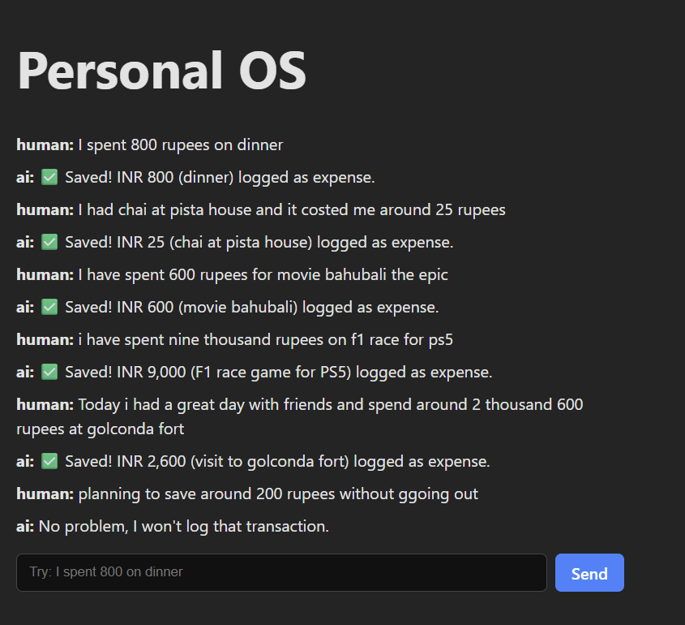
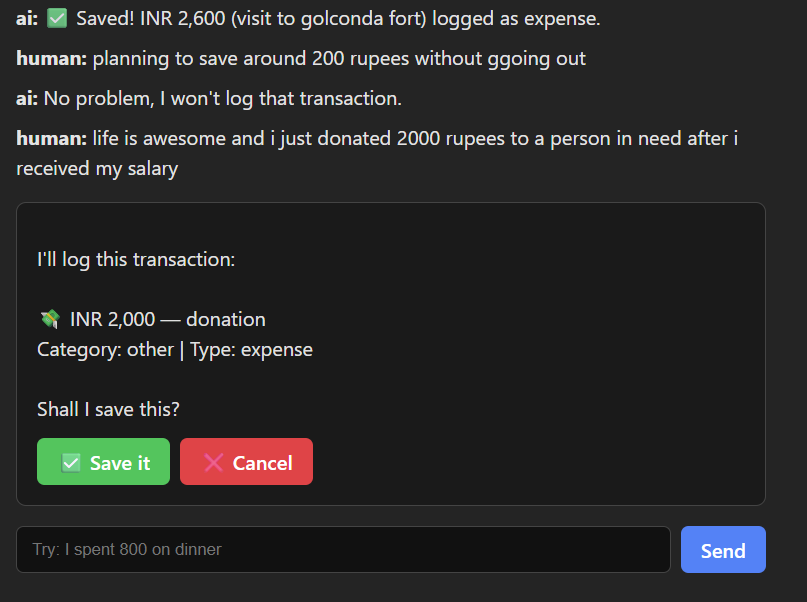
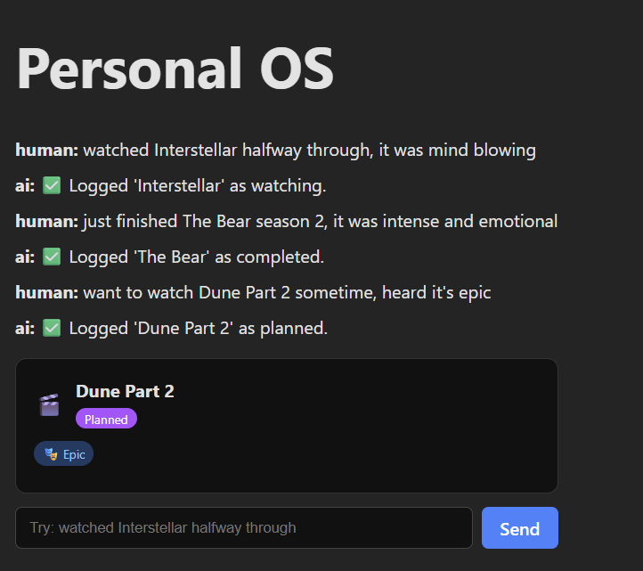
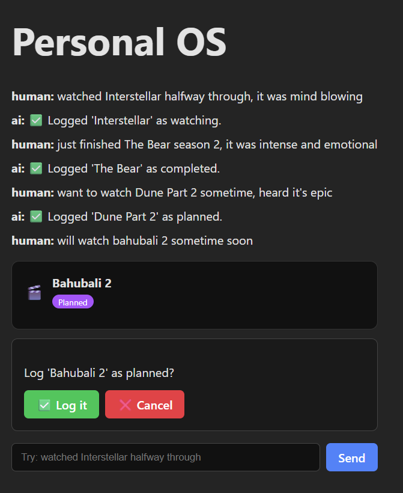
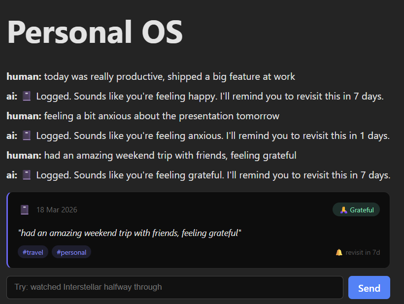
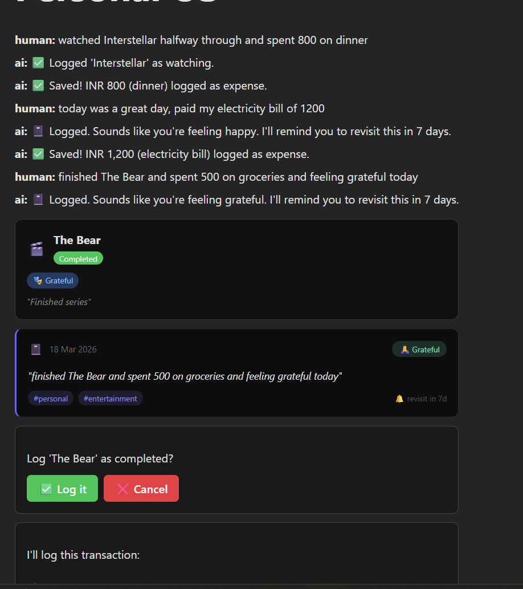

# frontend working notes

- setting up frontend with [react-vite-ts](https://vite.dev/guide/#scaffolding-your-first-vite-project)
  - `pnpm create vite frontend --template react-ts`

```bash
(backend)
abhis@Tinku MINGW64 ~/Desktop/personal-os (main)
$ pnpm create vite frontend --template react-ts
.../19ce235c5f4-7cb4                     |   +1 +
.../19ce235c5f4-7cb4                     | Progress: resolved 1, reused 0, downloaded 1, added 1, done
│
◇  Use Vite 8 beta (Experimental)?:
│  No
│
◇  Install with pnpm and start now?
│  Yes
│
◇  Scaffolding project in C:\Users\abhis\Desktop\personal-os\frontend...
│
◇  Installing dependencies with pnpm...

```

- creates the `frontend` app for us & launches the server right away.
- now we add the `langchain/langgraph-sdk` to interacting with the LangGraph REST API. [Refer docs](https://www.npmjs.com/package/@langchain/langgraph-sdk)
- @langchain/langgraph-sdk doc in [langchain](https://reference.langchain.com/javascript/langchain-langgraph-sdk)
- What @langchain/langgraph-sdk gives you:
  - `useStream()` hook - [reference](https://reference.langchain.com/javascript/langchain-langgraph-sdk/react/useStream)
  - `LoadExternalComponent` for Generative UI - [reference](https://reference.langchain.com/javascript/langchain-langgraph-sdk/react-ui/LoadExternalComponent)
  - TypeScript types for messages, interrupts, state

```bash
(backend)
abhis@Tinku MINGW64 ~/Desktop/personal-os/frontend (main)
$ pnpm add @langchain/langgraph-sdk
Packages: +7
+++++++
Progress: resolved 234, reused 180, downloaded 5, added 7, done

dependencies:
+ @langchain/langgraph-sdk 1.7.2

╭ Warning ───────────────────────────────────────────────────────────────────────────────────╮
│                                                                                            │
│   Ignored build scripts: esbuild@0.27.3.                                                   │
│   Run "pnpm approve-builds" to pick which dependencies should be allowed to run scripts.   │
│                                                                                            │
╰────────────────────────────────────────────────────────────────────────────────────────────╯
Done in 3.4s using pnpm v10.26.1
```

- Add this peer dependency for langgraph-sdk - `pnpm add @langchain/core`
- Also clean up the default code of react-vite-ts as we don't need it all & let's the test the connection.
- the frontend is able to test the connection with backend langgraph server. Looks cool.

- **Learning Notes**: Understanding `useStream` - [Refer this doc if needed](./learning_notes/useStream.md).

- Update `frontend/src/App.tsx` to match the new state shape — specifically add the `ui` field so TypeScript knows about it.
- `The graph always enters at the router node first. The router sets an intent field on state, then a conditional edge reads that intent and branches to the appropriate node - finance, movie, journal, or a fallback chat node. Each node returns updates that get merged back into state using reducers. The add_messages reducer appends rather than overwrites, which is how conversation history is preserved across turns.`

---

- Update the Frontend to Handle Interrupts:
  - Now update `frontend/src/App.tsx` to handle the interrupt and show Approve/Reject buttons



---

- Register the UI Component:
  - This is the Generative UI part. The backend pushes "movie_log_card" and the frontend needs a component registered under that name.
  - Create `frontend/src/components/ui/MovieLogCard.tsx`
- Wire Generative UI into App.tsx:
  - Update `frontend/src/App.tsx` to handle both the ui state (for rendering pushed components) and the movie interrupt.

```md
### 5.5 — Test It

Restart `langgraph dev` and try:
```

watched Interstellar halfway through, it was mind blowing

```

You should see:
1. Router classifies as `movie`
2. **MovieLogCard renders inline** in the chat with title, status, mood tags
3. Confirmation prompt appears below it
4. Click **Log it** → saved to DB, confirmation message appears

Also try:
```

finished The Bear, it was emotionally exhausting but brilliant
added Dune Part 3 to my watchlist

Try these one at a time, each in a fresh page refresh (so you get a new thread):

**Test 1 — Basic watching with mood:**

```
watched Interstellar halfway through, it was mind blowing
```

Expected: card shows `Watching`, progress `halfway`, mood tag `Mind-blowing`

**Test 2 — Completed with emotional tag:**

```
just finished The Bear season 2, it was intense and emotional
```

Expected: card shows `Completed`, mood tags like `Intense`, `Emotional`

**Test 3 — Adding to watchlist:**

```
want to watch Dune Part 2 sometime, heard it's epic
```

Expected: card shows `Planned`, maybe a context tag like `Epic`

---

For each one — card should appear → confirm buttons show → click **Log it** → single confirmation message → no duplicate card. Let me know how all three go.




---
---
---

- JournalEntryCard Component - Create `frontend/src/components/ui/JournalEntryCard.tsx`
- Register in App.tsx : Two small additions to App.tsx

```md
### 6.5 - Test It

Restart `langgraph dev` and try:
---
today was really productive, shipped a big feature at work
---
feeling a bit anxious about the presentation tomorrow
---
had an amazing weekend trip with friends, feeling grateful
```

- Each should: router classifies as journal → card appears instantly → confirmation message → no confirm buttons (intentional, no interrupt).
- Why No Interrupt for Journal?: "Journal entries are low-stakes writes - there's nothing destructive about logging a thought. The human-in-the-loop pattern adds friction that hurts the experience here. I made a deliberate architectural decision to only use interrupt() for financial writes and movie logs where the user might want to correct extracted data. Journal entries save immediately because the cost of being wrong is zero - you can always add another entry."



---
---
---

- Handle Multiple Interrupts on the Frontend: When two nodes run in parallel and both hit `interrupt()`, the thread state will have two interrupts. Update the `useEffect` in App.tsx to handle this.

```md
### 7.4 - Test It

Restart `langgraph dev` and try these multi-intent messages:

watched Interstellar halfway through and spent 800 on dinner

Expected: `[Router] intents=['movie', 'finance']` → both cards appear → two confirm prompts

today was a great day, paid my electricity bill of 1200

Expected: `[Router] intents=['journal', 'finance']` → journal saves instantly, finance shows confirm

finished The Bear and spent 500 on groceries and feeling grateful today

Expected: [Router] intents=['movie', 'finance', 'journal'] → all three fire
```

- When the router detects multiple intents, instead of routing to one node, I use LangGraph's Send API to dispatch to multiple nodes simultaneously. Each Send() passes the current state to a different node as an independent branch. They execute in parallel as part of the same superstep. The add_messages reducer on state handles merging the results back. This is the map-reduce pattern - fan out to N nodes, results fan back in.

